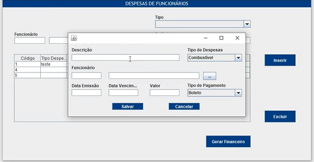
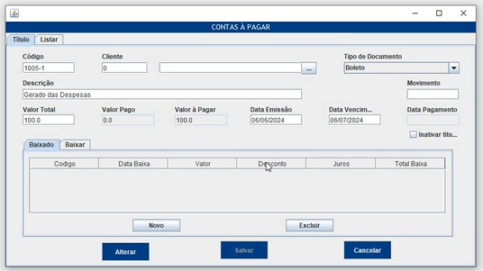

# DMS Soluções

## Descrição 

Este sistema é projetado para gerenciar de forma simplificada as finanças e os cadastros da empresa. Ele inclui funcionalidades para controle de contas a receber e a pagar, além de permitir o registro de movimentações financeiras.

### Principais Funcionalidades:

1. Faturamento de Contratos:
    - Gerar contas a receber com base nas parametrizações definidas nos cadastros dos contratos.
    - Facilitar o acompanhamento de receitas, garantindo precisão e organização.

2. Controle de Despesas:
    - Registrar despesas de funcionários, incluindo alimentação, transporte e outras categorias.
    - Automatizar a geração de contas a pagar, melhorando a eficiência no controle de custos.

3. Gerenciamento de Cadastros:
    - Gerenciar informações de clientes, contratos e despesas de forma centralizada e acessível.

4. Baixas de Contas:
    - Realizar as baixas das contas a pagar e a receber, assegurando que todos os registros financeiros estejam sempre atualizados.

### Ferramentas:

- Back-End: Java 
- Front-End: Java Swing
- Banco de dados: SQL Server
- IDE: Eclipse

### Informações:

Este sistema foi desenvolvido como um projeto de extensão no meio acadêmico, com o objetivo de aplicar conhecimentos adquiridos e resolver uma problemática real de uma empresa parceira. A empresa escolhida para essa parceria foi a GV Segurança Eletrônica, especializada em instalações e manutenção de equipamentos eletrônicos, que enfrentava dificuldades na gestão de suas despesas e receitas.

Este projeto foi desenvolvido por: Mariana Freire, Marilza Santos e Diogenes Leonardo.

## Layout
### Telas de Controle

### Telas de Cadastro

## Demonstração
<video controls src="imagens/Vídeo WhatsApp 2024-06-27 às 12.20.47_0c6fb660-1.mp4" title="Title"></video>

